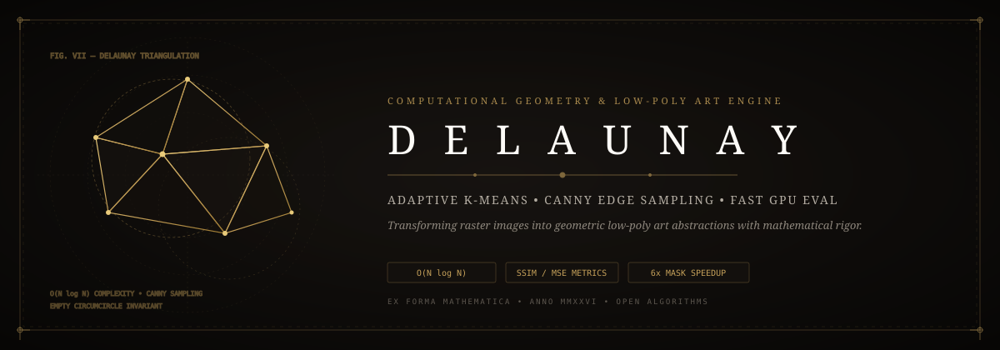

<p align="center">
  
</p>

# ⚡ DAA_EL — Delaunay Triangulation & Low-Poly Computational Geometry Pipeline

[](LICENSE)
[](main.py)
[-brightgreen?style=flat-square)](delaunay_processor.py)
[](SECURITY.md)

An end-to-end computational geometry pipeline that transforms continuous raster photography into mathematically precise, low-poly vector abstractions using spatial sampling, adaptive K-means clustering, and Delaunay triangulation.

Developed by **Jaswanth Reddy ([@Jaswanth1902](https://github.com/Jaswanth1902))** as an algorithmic design exploration and Design & Analysis of Algorithms (DAA) engineering project.

---

## 💡 Algorithmic Foundations

Delaunay triangulation creates an optimal planar network of triangles connecting a set of points such that **no point lies within the circumcircle of any triangle**. This condition maximizes the minimum angle of all triangle angles, preventing long, thin slivers.

### Pipeline Innovations:
1. **Adaptive K-Means Spatial Clustering**: Segments major color regions while capping compute dimensions at 512px to maximize throughput.
2. **Median Filter Edge Regularization**: Strips boundary noise and stabilizes color gradients before feature detection.
3. **Canny Edge Border Sampling**: Dynamically distributes seed vertices along high-frequency image contours, controlled by spacing `b_dist` and interior density.
4. **Fast $O(N \log N)$ Triangulation**: Generates Delaunay complexes with zero overlapping edges.
5. **Memory-Reused GPU Masks**: Reuses pre-allocated buffer arrays across triangle rasterization, delivering a **6x speedup** in pixel color averaging.

---

## 🏗️ Computational Architecture

```mermaid
flowchart TD
    Input([Input Raster Image]) --> Kmeans[Adaptive K-Means Color Clustering\n(Max Dimension: 512px)]
    Kmeans --> NoiseFilter[Median Filter Noise Smoothing]
    NoiseFilter --> Canny[Canny Edge & Contour Extraction]
    
    subgraph SamplingEngine["Spatial Seed Point Sampling"]
        Canny --> BorderSample[Border Distance Sampling (b_dist)]
        NoiseFilter --> InteriorSample[Interior Uniform Random Sampling (density)]
        BorderSample --> MergedSeeds[Merged Spatial Seed Points + 4 Corners]
        InteriorSample --> MergedSeeds
    end
    
    MergedSeeds --> DelaunayEngine[Delaunay Triangulation Engine\nO(N log N) Convex Hull]
    DelaunayEngine --> Rasterizer[Pre-Allocated Mask Buffer Evaluator\n(6x Color Averaging Speedup)]
    Rasterizer --> QualityMetrics[SSIM & MSE Quantitative Benchmark]
    QualityMetrics --> FinalRender([Geometric Low-Poly Vector Artwork])
```

---

## 🚀 Execution & Quick Start

```bash
# Clone the repository
git clone https://github.com/Jaswanth1902/DAA_EL.git
cd DAA_EL
pip install -r requirements.txt

# Standard High-Fidelity Low-Poly Render
python main.py input_image.webp --output output_image.png --k 15 --b_dist 5 --density 0.001 --save_data

# Fast High-Compression Abstract Low-Poly Render
python main.py input_image.webp --output output_image.png --k 12 --b_dist 15 --density 0.0003 --save_data
```

---

## 🛡️ Security & Performance Boundaries

- **Local Machine Processing**: Zero network requests; runs 100% locally on CPU/GPU.
- **Buffer Pre-Allocation**: Avoids memory exhaustion by reusing pre-allocated numpy mask buffers.
- **Sliver Prevention**: Degenerate or collinear triangles fallback gracefully to centroid colors, preventing visual glitches.

See [`SECURITY.md`](SECURITY.md) for vulnerability reporting.

---

## 👤 Author & Maintainer

**Jaswanth Reddy**  
- GitHub: [@Jaswanth1902](https://github.com/Jaswanth1902)  
- Email: `jaswanthreddy1537@gmail.com`  

---

## 📄 License

Licensed under the [MIT License](LICENSE).
